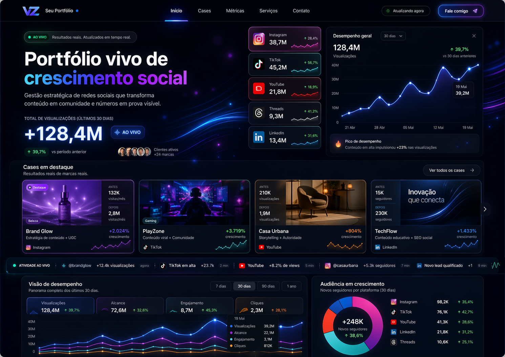
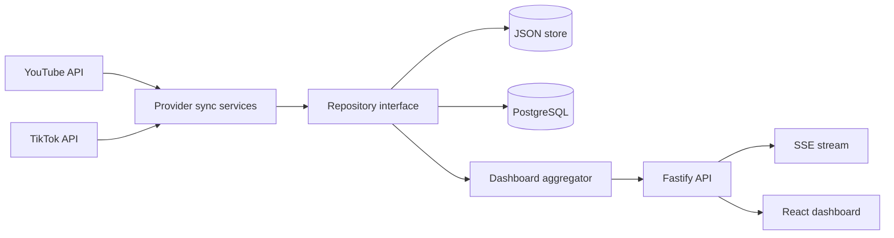

# ViewCounter

A full-stack social-metrics dashboard that connects authorized YouTube and TikTok accounts, snapshots total views, aggregates growth and streams updated projections to a portfolio interface.

**Status: experimental — local build available; the repository's previous public deploy currently returns 404. Do not redeploy until OAuth-token encryption is implemented.**

## Why this exists

Platform dashboards expose metrics in different formats and time windows. ViewCounter normalizes authorized account snapshots into one history, preserves the last valid measurement when a provider fails and gives the frontend one projection model.

## What it does

- official OAuth flows for YouTube and TikTok;
- account and connection persistence;
- periodic or manual platform synchronization;
- total-view snapshots and growth aggregation;
- JSON-file and PostgreSQL repository adapters;
- sync-job history and degraded account status after provider failures;
- Server-Sent Events projection every 15 seconds;
- public dashboard plus administrative connection/sync endpoints.

Instagram and other visual cards in the seed dashboard are illustrative; current OAuth implementations cover YouTube and TikTok.

## Product preview



The image is a design reference stored in the repository. Its brands, totals and growth figures are illustrative and must not be interpreted as live customer evidence.

## Architecture



## Synchronization and failure handling

Each provider connection has an access token, optional refresh token, expiry and last profile snapshot. Scheduled sync is disabled when its interval is `0`. A failed provider call records a failed sync job, marks the account as warning and preserves the last valid metric snapshot rather than replacing it with fabricated data.

TikTok aggregation scans paginated videos up to `TIKTOK_MAX_VIDEO_PAGES`; `partialScan` remains observable when the page cap is reached. External API quotas, token revocation and provider schema changes remain operational dependencies.

## Persistence

- `DATA_PROVIDER=json` writes `server/data/dashboard-store.json` and is intended for local development.
- `DATA_PROVIDER=postgres` uses the schema in [`server/src/db/schema.sql`](server/src/db/schema.sql).

OAuth access and refresh tokens are currently stored in plaintext in both providers. JSON persistence must not be used with real credentials on shared machines, and the PostgreSQL mode requires application-level envelope encryption before production use.

## Local development

Requirements: Node.js 20+, npm; PostgreSQL only for the Postgres provider.

```bash
git clone https://github.com/4LFR3Dv1/ViewCounter.git
cd ViewCounter
cp .env.example .env
npm ci
npm run dev
```

Frontend: `http://localhost:5173`  
API: `http://localhost:8787`  
Health: `http://localhost:8787/health`

## Configuration

See [`.env.example`](.env.example) for every supported variable.

- `ADMIN_TOKEN` is mandatory for `/api/admin/*`; admin routes fail closed when it is absent.
- YouTube and TikTok client secrets are backend-only.
- Redirect URIs must exactly match the corresponding provider console.
- `ALLOWED_ORIGINS` should contain only deployed frontend origins.
- A nonzero sync interval enables the respective in-process scheduler.

## Verification

```bash
npm run verify
```

The current gate compiles the client and server TypeScript builds. Provider integration tests and browser E2E coverage remain open gaps and are not claimed by this command.

## Security and privacy

- OAuth `state` is bound to short-lived HttpOnly cookies.
- Production cookies use `Secure` and `SameSite=Lax`.
- CORS uses an explicit origin allowlist.
- Administrative routes require a bearer token and fail closed when it is not configured.
- Security headers deny framing and restrict browser capabilities.
- OAuth tokens are not encrypted at rest: this blocks a production redeploy.
- No external security audit is claimed.

## Current status and limitations

- The prior Vercel URL returns 404.
- YouTube and TikTok are the only implemented OAuth/sync providers.
- OAuth credentials are stored in plaintext at rest.
- Scheduler state is process-local and not coordinated across replicas.
- JSON writes do not provide a multi-process transaction boundary.
- Provider quotas and API policy changes can delay or stop synchronization.
- Automated integration and E2E tests are not yet present.

## License

No license file has been published. Source availability does not by itself grant reuse or redistribution rights; licensing remains a maintainer decision.

